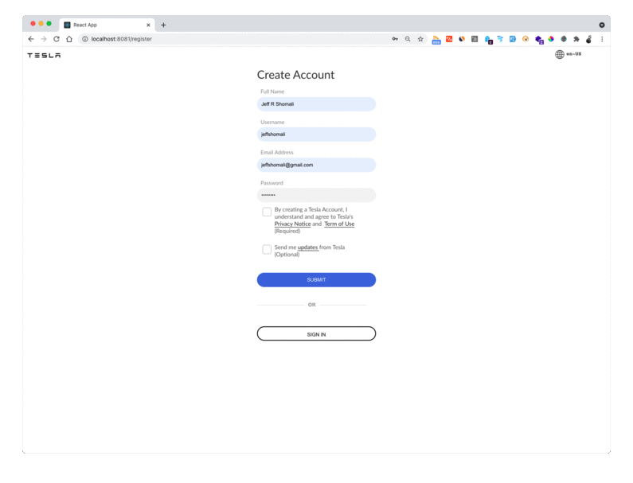

## Cloning Tesla Authentication and Dashboard

 This is a fun project for warming up my upcoming interview with Tesla. This is a cloning Tesla.com website that handle login authentication and dashboard. I used my account as reference and build the UI and backend.

 **Front End Technology**: React, React-DOM, React-scripts, React-validation, Validator, Axios. 
 **Back End Technology**: bcryptjs, body-parser, cors, express, jsonwebtoken, mysql2, sequelize.

**Result**

**Roadmap**
 - [ ] Front End 
   - [x] Sign In Page
   - [x] Sign Up Page
   - [x] Dashboard  Page
   - [x] Delivery Status Page
   - [ ] Form Validation and Error Handling
   - [ ] Reusability and Modulation
   - [ ] Fix the Checkbox
   - [ ] Profile Page
   - [ ] Testing(Jest)

### Run The project 
**Backend** 
  - Clone the Project `$ git clone git@github.com:JeffShomali/tesla.git`
  - Go to backend directory `$ cd backend`
  - Install dependencies `$ npm install`
  - Create a MySQL Database and modify the `backend/app/config/db.config.js` file.
  - Run the server with `$ node server.js` this should be running while running the front end.
**Front End**:
  - Go to `front` directory.
  - Install dependencies `$ npm i`
  - Run the application `$ yarn start`
  ...